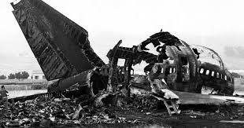
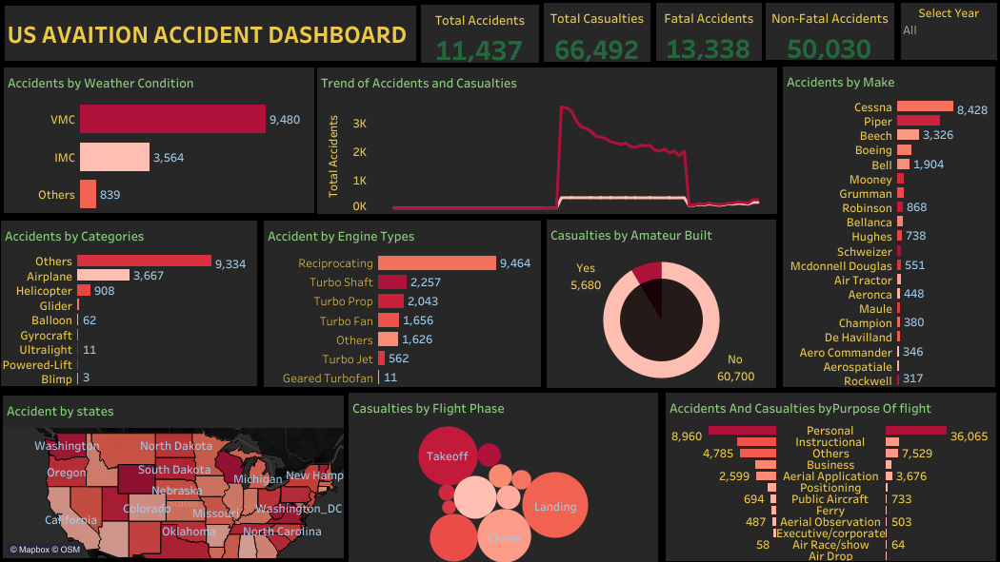
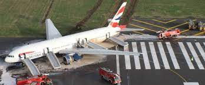

### US ACCIDENT AVIATION

## Introduction
This analysis covers a period of accidents in the US aviation sector between 1948 to 2022. Aviation accidents are flight related accidents. These also involve different flight phases ranging from pre flight take off, post flight take off, pre- flight test , aerial view and other forms of flight uses like aerial application of fertilizer and so on. The datasets source is from www.kaggle.com.

## Problem Statement
The Objectives of this analysis is to gain insight into various pattern of accidents and casualties and make recommendations based on the repeated patterns and trends over the years in order reduce or prevent subsequent accidents and hence casualties in the US aviation. These objectives are;

- Total accidents, total casualties, fatal accidents and non fatal accidents.
 
- Accident trends between the year under consideration.
 
- Accident by aircraft categories
 
- Accidents by engine types
 
- Accidents by aircraft make
 
- casualties by flight phases
 
- Accidents and casualties based on flight purposes
 
- ccidents at the prevailing weather condition.

  ## Skils Demostrated
  - Measure created using calculated field.
  - Parametere created using calculated field.
  - Slicers
  - Filters

 ## Data Sourcing
  This dataset was downloaded directly from www.kaggle.com. a csv file, having over 74000 rows and 25 columns. [you can check the data out here](USAviationData.xlsx)

  ## Data Transformation
  Excel's power query was used for data cleaning, nulls values were filtered, unwanted columns were removed. 

  ## Data Modelling
  This dataset has two files, relatiohship was established on data source in Tableau using country in the first file and country code in the second file to create a join.
  

## Data Cleaning and Transformation
The first dataset(US Accidents) is a very large dataset with over 74,000 rows, while the second contains the Us state codes. Excel is used for data profiling, then consequently, I used Power query for data cleaning and transformation. The cleaned data was connected to Tableau. Relationship was established between the accident location and the state codes in the other dataset.

## Analysis And Vitualization

[click here for the interactive dashboard](https://public.tableau.com/app/profile/joseph.adedayo/viz/USAVIATIONACCIDENTDASHBOARD/USAVIATIONACCIDENT)

- Total Accidents at the period was 11,437, Total casualties was over 60,000, over 50,000 of the total casualties were non fatal and Fatal accidents stood at 13, 338.
  
- The trend shows that accidents and casualties were at their peak in1981, then overtime has been falling due to modern technology advancement and sensors.
  
- The aircraft make of Cessna was involved in about two-third of the accidents during the period.
  
- An aircraft category called blimp was involved in the least accidents.
  
- Gear turbofan engine type aircraft had the least accident why reciprocating engine type was involved in the highest more accidents than others, there they are the safest.
  
- More accidents occurred during landing phase than other accident phases.

Recommendation and Conclusions
- Extra precaution should be taken ,when landing and emergency unit should be on stand by.
  
-The Rockwell aircraft make should be demanded more by the aviation industry having the least number of accidents.

- Flight during VMC weather condition should only proceed based on necessity.

Thank you
